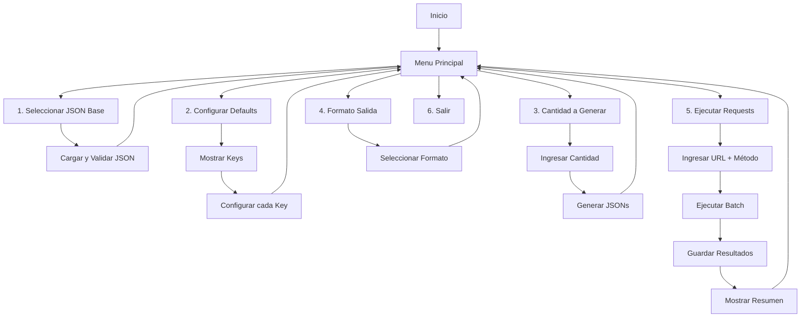

# Plan de Continuación - Proyecto BAD

## Fase 1: Refactorización y Correcciones Base

### 1.1 Corregir interface IGenerator

El archivo [BAD/Generator/IGenerator.cs](BAD/Generator/IGenerator.cs) está vacío. Definir un contrato útil o eliminarla si no aporta valor.

```csharp
public interface IGenerator<T>
{
    T Generate();
    T Generate(T min, T max);
}
```

### 1.2 Implementar EnumOperations

El enum en [BAD/Generator/Configurations/EnumOperations.cs](BAD/Generator/Configurations/EnumOperations.cs) existe pero no se usa. Integrarlo en `DefaultValueConfig` para controlar el comportamiento de cada campo:

- `NotChange`: mantener valor original
- `Replace`: reemplazar con valor configurado
- `ForceNull`: forzar null

### 1.3 Mejorar GeneratorJson

En [BAD/Generator/GeneratorJson.cs](BAD/Generator/GeneratorJson.cs):

- Hacer configurables los rangos de generación (actualmente hardcodeados: edad 18-70, float 100-1000)
- Agregar manejo de errores

---

## Fase 2: Menú de Consola Interactivo

### 2.1 Opción 1 - Seleccionar archivo base

Implementar en [BAD/Program.cs](BAD/Program.cs):

- Listar archivos JSON de la carpeta `jsonfiles`
- Permitir selección con flechas
- Validar que el archivo sea JSON válido

### 2.2 Opción 2 - Definir datos por defecto

- Mostrar las keys del JSON seleccionado
- Permitir configurar por cada key: valor fijo, lista de valores, o aleatorio
- Usar `DefaultValueConfig` y `EnumOperations`

### 2.3 Opción 3 - Cantidad de JSON a generar

- Input numérico con validación
- Mostrar preview de un JSON generado

### 2.4 Opción 4 - Formato de salida

- Opción A: Un archivo por JSON generado
- Opción B: Todos los JSON en un solo archivo
- Opción C: Solo consola (sin persistencia)

---

## Fase 3: Ejecución de Requests (Features #11 y #17)

### 3.1 Crear clase RequestExecutor

Nueva clase en `Services/` para orquestar ejecución masiva:

```csharp
public class RequestExecutor
{
    public async Task<List<RequestResult>> ExecuteBatch(
        string url, 
        HttpMethod method, 
        List<string> jsonPayloads);
}
```

### 3.2 Modelo de resultado

```csharp
public class RequestResult
{
    public int Index { get; set; }
    public string RequestPayload { get; set; }
    public string ResponseBody { get; set; }
    public HttpStatusCode StatusCode { get; set; }
    public TimeSpan Duration { get; set; }
    public string Error { get; set; }
}
```

### 3.3 Agregar opción al menú

- Nueva opción: "Ejecutar contra endpoint"
- Solicitar URL y método (GET/POST)
- Mostrar progreso de ejecución

---

## Fase 4: Persistencia de Resultados (Feature #12)

### 4.1 Crear clase ResultStorage

Nueva clase en `Services/`:

- Guardar resultados en carpeta `output/`
- Formato: `{timestamp}_{filename}/`
  - `requests/` - JSONs enviados
  - `responses/` - Respuestas recibidas
  - `summary.json` - Resumen de ejecución

### 4.2 Generar reporte de resumen

```json
{
  "totalRequests": 10,
  "successful": 8,
  "failed": 2,
  "averageResponseTime": "150ms",
  "errors": [...]
}
```

---

## Fase 5: Mejoras de UX de Consola

### 5.1 Agregar colores y formato

- Verde: éxito
- Rojo: errores
- Amarillo: warnings
- Barra de progreso para ejecución masiva

### 5.2 Validaciones y mensajes claros

- Validar que se haya seleccionado archivo antes de generar
- Mensajes de error descriptivos

---

## Diagrama de Flujo Final




---

## Archivos a Crear


| Archivo                       | Propósito                       |
| ----------------------------- | ------------------------------- |
| `Services/RequestExecutor.cs` | Orquestador de requests masivos |
| `Services/ResultStorage.cs`   | Persistencia de resultados      |
| `Models/RequestResult.cs`     | Modelo de resultado de request  |
| `Models/ExecutionSummary.cs`  | Modelo de resumen de ejecución  |
| `ConsoleUI/MenuHelper.cs`     | Helpers para UI de consola      |


---

## Prioridad de Implementación

1. **Alta**: Fases 1-2 (base funcional + menú)
2. **Media**: Fases 3-4 (ejecución y persistencia)
3. **Baja**: Fase 5 (mejoras UX) + Features CSV (#8, #9, #13)

