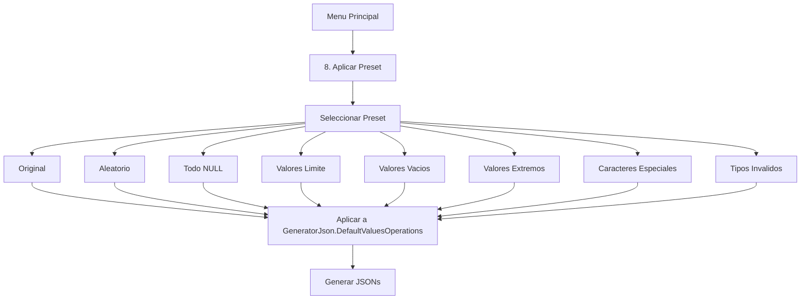

# Sistema de Presets de Mutaciones

## Objetivo

Agregar una opcion en el menu principal para aplicar "presets" o configuraciones predeterminadas que muten todo el JSON de forma masiva, sin tener que ir campo por campo.

## Presets a Implementar

### 1. Presets Basicos

- **Original**: Mantener todos los valores originales del JSON
- **Aleatorio**: Generar valores aleatorios para todos los campos (comportamiento actual por defecto)
- **Todo NULL**: Forzar todos los valores a null

### 2. Presets de Testing/QA

- **Valores Limite (Boundary)**: Usar valores en los limites segun tipo
  - Integer: 0, -1, MAX_INT, MIN_INT
  - Float: 0.0, -0.0, float.MaxValue
  - String: "" (vacio), " " (espacio)
  - Boolean: alternar true/false
  - Date: DateTime.MinValue, DateTime.MaxValue
- **Valores Vacios (Empty)**: 
  - String: ""
  - Integer/Float: 0
  - Boolean: false
  - Arrays: []
- **Valores Extremos (Extreme)**:
  - String: 1000+ caracteres
  - Integer: valores muy grandes/pequenos
  - Float: muchos decimales

### 3. Presets de Seguridad

- **Caracteres Especiales (Injection)**:
  - SQL Injection: `'; DROP TABLE users; --`
  - XSS: `<script>alert('xss')</script>`
  - Unicode: caracteres especiales, emojis
  - Path traversal: `../../../etc/passwd`
- **Tipos Invalidos (Invalid)**:
  - Donde va int, poner string
  - Donde va bool, poner numero
  - Donde va fecha, poner texto invalido

## Arquitectura

### Nuevos Archivos

```
BAD/
├── Presets/
│   ├── IPreset.cs              # Interface para presets
│   ├── PresetManager.cs        # Gestor de presets
│   └── Mutations/
│       ├── OriginalPreset.cs
│       ├── RandomPreset.cs
│       ├── AllNullPreset.cs
│       ├── BoundaryPreset.cs
│       ├── EmptyPreset.cs
│       ├── ExtremePreset.cs
│       ├── InjectionPreset.cs
│       └── InvalidTypesPreset.cs
```

### Interface IPreset

```csharp
public interface IPreset
{
    string Name { get; }
    string Description { get; }
    Dictionary<string, DefaultValueConfig> GenerateConfig(JObject jsonTemplate);
}
```

### Flujo de Uso




## Modificaciones en Program.cs

- Agregar nueva opcion "8. Aplicar preset de mutacion" en el menu principal
- Mostrar submenu con todos los presets disponibles
- Al seleccionar un preset, aplicar la configuracion masiva a `GeneratorJson.DefaultValuesOperations`

## Archivos a Modificar

- [BAD/Program.cs](BAD/Program.cs): Agregar opcion de menu y logica de seleccion de presets
- [BAD/Generator/GeneratorJson.cs](BAD/Generator/GeneratorJson.cs): Metodo para aplicar configuraciones masivas

